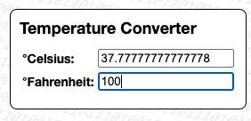

# reactive-scriptable-components (RSC) #

light-weight reactive scriptable web components

> **Warning**: this framework is currently under active development - consider it as incomplete pre-alpha software: anything may change, some changes _may_ even break existing applications (although I don't _expect_ any of them). Thus, please stay tuned and come back here from time to time to see if there is a (well-documented) version that you may safely use...

The idea behind this framework is to allow for the rapid development of small reactive web applications. To give you an idea of what these web apps could look like, consider the following example (which implements a simple calculator that converts temperatures between °Celsius and °Fahrenheit, see [live demo](https://rozek.github.io/reactive-scriptable-components/examples/Temperature-Converter.html)):



```html
  <rsc-applet>
   <rsc-title>Temperature Converter</rsc-title>
   <rsc-tabular columns="2">
    <rsc-label>°Celsius:</rsc-label>
    <rsc-native-number-input $$value="Applet:observed.Celsius"></rsc-native-number-input>

    <rsc-label>°Fahrenheit:</rsc-label>
    <rsc-native-number-input $$value="Applet:observed.Fahrenheit"></rsc-native-number-input>
   </rsc-tabular>

   <script type="rsc-script">
    const observed = Object.assign(this.observed,{
      Celsius:0,
      Fahrenheit:0
    })

    reactively(() => observed.Fahrenheit = observed.Celsius * 9/5 + 32)
    reactively(() => observed.Celsius = 5/9 * (observed.Fahrenheit-32))
   </script>
  </rsc-applet>
```

The example basically consists of two number input controls, a bit of visual "decoration" and some "business logic".

What makes it interesting is how the logic works:

* `$$value` attributes make the number input controls "reactive" (in both directions), i.e., user input changes the specified variable and variable changes will be reflected in the UI - and, yes, the circularity of the dependencies shown above causes no problem
* every "reactive scriptable component" (which is a standard [web component](https://developer.mozilla.org/en-US/docs/Web/API/Web_components)) may contain its own `observed` and `unobserved` (state) variables - in this trivial example, only the applet itself provides some "state", whereas the input controls do not
* whenever an `observed` variable is changed, all functions using that variable may be `reactively` recalculated - in this example, changes of the `Celsius` variable will recompute the `Fahrenheit` variable and vice-versa - and the `$value` reactivity will automatically update the number input fields.

This approach allows to write simple web applications within minutes - the author uses it for his computer science lectures at [Stuttgart University of Applied Sciences](https://www.hft-stuttgart.com/) in order to demonstrate various concepts and algorithms or give students the possibility to practice what they learned. You probably won't use "reactive-scriptable-components" to implement the next office package, but simple tools can be written with very little effort and in a way that may easily be understood even by inexperienced or casual programmers.

**NPM users**: please consider the [Github README](https://github.com/rozek/reactive-scriptable-components) for the latest description of this package (as updating the docs would otherwise always require a new NPM package version)

> Just a small note: if you like this module and plan to use it, consider "starring" this repository (you will find the "Star" button on the top right of this page), so that I know which of my repositories to take most care of.

## Features ##

"reactive-scriptable-components" offer the following fundamental features:

- **Script Attributes**<br>(small) scripts may be directly provided as an HTML attribute of a component - this keeps an element and it's functionality together
- **Script Elements**<br>(larger) scripts may be provided as a `<script type="rsc-script"/>` element within the component they belong to - e.g., below all other inner HTML elements. This approach keeps the internal structure of an RSC component visible and still allows a component and its code to be kept close together
- **Delegated Scripts**<br>if you want to separate the "look" from its "feel", you may provide "delegated scripts" (`<script type="rsc-script" for="..."/>`) for elements that can be identified by a CSS selector (e.g., `#id`, `.class`, `[attr="value"]` etc.)
- **Behaviour Scripts**<br>if you have multiple RSC components that share the same functionality, you may define a "behaviour" and provide the shared code in a separate `<script type="rsc-script" for-behaviour="..."/>` element. If there are both a behaviour and an element script for a given RSC component, the behaviour script is executed before the element script.
- **Observed and Unobserved Variables**<br>RSC components usually have to store some values they need for their operation. For that purpose, RSC provides both an `observed` and an `unobserved` data structure for every component which can be freely used as required. "Observed" entries may then be used to trigger "reactive functions" or update "reactive attributes" whenever their values change
- **Reactive Functions**<br>"reactive functions" (defined using `reactively(() => ...)`) are functions that will be automatically invoked whenever any of the observed(!) values they use internally have changed
- **Reactive Attributes**<br>"reactive attributes" have names starting with one or two dollar signs (e.g., `$value` or `$$value`) and establish a "reactive binding" between a reactive variable of the component itself (`observed.value` in this example) and another reactive variable in an outer RSC component - both a reference to that outer component and the path to the other reactive variable have to be specified in the attribute itself
- **Event Handlers as Function Calls**<br>sometimes, RSC components do not directly change other (reactive) variables but initiate an activity - to support such use cases, RSC components may trigger events or handle them. In contrast to DOM events, however, RSC events may be used like function calls, i.e., it is allowed to provide arbitrary arguments and possible to wait for a result from event handling
- **Error Indicators**<br>often, it is difficult to recognize and track errors which occured in behaviour or component scripts, or during event handling. For that reason, RSC marks faulty components with an "error indicator": just click on such an indicator to reveal details about the detected error

## Browser Requirements (and Polyfills) ##

RSC is based on relatively modern web technologies which _should_ already be available in most browsers out-of-the-box - but for those that lack these features (particularily Safari versions < 16.4 or devices with iOS versions < 16.4), polyfills have been included in the examples to plug these holes:

- [Import Maps](https://developer.mozilla.org/en-US/docs/Web/HTML/Element/script/type/importmap) (see [availability across browsers](https://caniuse.com/mdn-html_elements_script_type_importmap))<br>for a polyfill see [https://github.com/guybedford/es-module-shims](https://github.com/guybedford/es-module-shims)
- [Custom Elements v1](https://developer.mozilla.org/en-US/docs/Web/API/Web_components/Using_custom_elements) (see [availability across browsers](https://caniuse.com/?search=Custom%20Elements))<br>for a polyfill see [https://github.com/webcomponents/webcomponentsjs](https://github.com/webcomponents/webcomponentsjs)

## Inlined Dependencies ##

"reactive-scriptable-components" are based on the following (brilliant!) libraries and packages:

* [HTM (Hyperscript Tagged Markup)](https://github.com/developit/htm) - for easy HTML markup using JavaScript template strings,
* [PREACT](https://github.com/preactjs/preact) - from which its efficient and light-weight DOM diffing is used, and
* [Hyperactiv](https://github.com/elbywan/hyperactiv) - a light-weight reactive library which even handles circular dependencies

All these dependencies have been bundled into a single module for faster loading and a predictable user experience.

> Nota bene: while it may be advisable to [know how to use HTM](https://github.com/developit/htm?tab=readme-ov-file#syntax-like-jsx-but-also-lit), there is no immediate need to learn any of the above to write an RSC application.

The final distributables were built using the marvellous [microbundle](https://github.com/developit/microbundle).

## Installation ##

In order to avoid initial flashing of "custom Elements" (aka "Web Components") you should always add the following lines at the beginning of the `<head/>` section in your HTML file:

```html
<style>
  :not(:defined) { visibility:hidden }
</style>
```

This trick applies to all kinds of Web Components, not just those presented here.

Most modern browsers already support import maps and web components out-of-the-box - except Safari browsers < 16.4 or (any browsers on) devices with iOS < 16.4. If you need to support these browsers as well, you should add the following lines directly after the `<style/>` section mentioned above:

```html
 <!-- Import Map Polyfill from https://github.com/guybedford/es-module-shims -->
 <script src="https://rozek.github.io/reactive-scriptable-components/polyfills/es-module-shims.js"></script>
 <!-- Web Components Polyfill from https://github.com/webcomponents/webcomponentsjs -->
 <script src="https://rozek.github.io/reactive-scriptable-components/polyfills/webcomponents-bundle.js"></script>
```

### Using RSC in a "No-Build Environment" (e.g., directly in the Browser) ###

If you don't use any kind of build tool but create your web application directly in the browser or in an HTML file, you should first provide an "import map" that allows scripts to import modules by name rather than by URL. Just append the following lines to the `<head/>` section of your HTML file:

```html
 <script type="importmap">
 {
  "imports": {
    "reactive-scriptable-library": "https://rozek.github.io/reactive-scriptable-components/dist/reactive-scriptable-components.modern.js",
    "RSC":                         "https://rozek.github.io/reactive-scriptable-components/dist/reactive-scriptable-components.modern.js"
  }
 }
 </script>
```

Then, if you don't use any package that already _imports_ the RSC module, _load_ it with the following lines:

```html
<script type="module"
 src="https://rozek.github.io/reactive-scriptable-components/dist/reactive-scriptable-components.modern.js"
></script>
```

Otherwise, just _load your package_, e.g. the `full-bundle` with all predefined RSC behaviours:

```html
 <script type="module"
  src="https://rozek.github.io/reactive-scriptable-components/behaviours/full-bundle.js"
 ></script>
```

### Using RSC with a Module Bundler ###

(t.b.w)

## Applet Creation ##

(t.b.w)

### Component Usage ###

(t.b.w) (lifecycle handling, nesting, containment validation)

### Additional Element Properties and Methods ###

(t.b.w)

- **`Applet`**<br>is a getter which returns a reference to the closest visual of 'this' one with behaviour "Applet"
- **`Card`**<br>is a getter which returns a reference to the closest visual of 'this' one with behaviour "Card"<br>&nbsp;<br>
- **`outerVisual`**<br>is a getter which returns a reference to the next outer visual of 'this' one
- **`outermostVisual`**<br>is a getter which returns a reference to the outermost visual of 'this' one
- **`closestVisualWithBehaviour (BehaviourName)`**<br>returns a reference to the closest visual of 'this' one with the given `BehaviourName` - please note, that the "closest visual" may also be 'this' one
- **`closestOuterVisualWithBehaviour (BehaviourName)`**<br>returns a reference to the closest _outer_ visual of 'this' one with the given `BehaviourName`
- **`closestVisualMatching (Selector)`**<br>returns a reference to the closest visual of 'this' one matching the given `Selector` - please note, that the "closest visual" may also be 'this' one
- **`closestOuterVisualMatching (Selector)`**<br>returns a reference to the closest _outer_ visual of 'this' one matching the given `Selector`<br>&nbsp;<br>
- **`innerVisuals`**<br>is a getter which returns a (possibly empty) list of all visuals which are direct children of 'this' one
- **`innerVisualsWithBehaviour (BehaviourName)`**<br>returns a (possibly empty) list of all visuals with the given `BehaviourName` which are direct children of 'this' one
- **`innerVisualsMatching (Selector)`**<br>returns a (possibly empty) list of all visuals with the given `BehaviourName` which match the given `Selector`

### Element Scripts ###

(t.b.w) (script as function bodies, script attributes, script elements, delegated scripts)

```javascript
function (
  my,me, RSC,JIL, onAttributeChange, onAttachment,onDetachment,
  toRender, html, on,once,off,trigger, reactively
) {
// this is where scripts are inserted
}
```

- **`my`**<br>contains a reference to `this` visual (i.e., the one in whose context the current script is running). If you define getters and setters for observed and unobserved variables, inside these accessors, `this` will refer to the data structure rather than to the visual - in such situations, `my` will help you refering to the actual visual. Additionally, you may use `my` to let your code look like ordinary english: e.g., `my.observed.Value = ...`
- **`me`**<br>is just a synonym for `me` and may be used wherever the resulting code will read more like ordinary english: e.g., in `my.render.bind(me)`<br>&nbsp;<br>
- **`RSC`**<br>contains a reference to RSC itself - thus, if you want to use any of its exported functions, you don't have to import the module yourself
- **`JIL`**<br>since RSC uses the [javascript-interface-library](https://github.com/rozek/javascript-interface-library) internally anyway, you may use this reference to that library in order to avoid having to import it in your scripts yourself<br>&nbsp;<br>
- **`onAttributeChange`**<br>`onAttributeChange((normalizedName,newValue) => ...)` can be used to install a function (with the given signature) that will be called whenever an attribute of an RSC element was changed. Only one callback function can be installed, later invocations of `onAttributeChange` overwrite previously registered callbacks
- **`onAttachment`**<br>`onAttachment(() => ...)` can be used to install a function that will be called whenever an RSC element is added to the DOM while RSC is running (and all behaviours have already been defined). Only one callback function can be installed, later invocations of `onAttachment` overwrite previously registered callbacks
- **`onDetachment`**<br>`onDetachment(() => ...)` can be used to install a function that will be called whenever an RSC element is removed from the DOM. Only one callback function can be installed, later invocations of `onDetachment` overwrite previously registered callbacks<br>&nbsp;<br>
- **`toRender`**<br>`toRender(() => ...)` can be used to install a function that will be called whenever an RSC element has to be (re-)rendered. Only one callback function can be installed, later invocations of `toRender` overwrite previously registered callbacks
- **`html`**<br>is a reference to the [htm markup function](https://github.com/rozek/htm#--htm-hyperscript-tagged-markup--) prepared for being used with [preact](https://github.com/preactjs/preact) - i.e., within RSC scripts<br>&nbsp;<br>
- **`on`**<br>`on(events, selectors, data, (Event) => ...)` can be used to install a handler for the given (comma-separated) list of `events`, sent from (RSC or DOM) elements identified by any of the (optionally) given (comma-separated) selectors ...
- **`once`**<br>
- **`off`**<br>
- **`trigger`**<br><br>&nbsp;<br>
- **`reactively`**<br>`reactively(() => ...)`

### Behaviour Scripts ###

(t.b.w) (behaviour registry, behaviour definition, behaviour and element scripts together)

### Observed and Unobserved Variables ###

(t.b.w) (accessors, scope)

### Reactive Functions ###

(t.b.w) (reactively, initial invocation, variable tracking, see hyperactiv)

### Reactive Attributes ###

(t.b.w) (access path, unidirectional/bidirectional binding)

### Rendering ###

(t.b.w) (see htm, DOM diffing by preact, initial rendering, automatic vs. manual re-rendering)

### RSC Events ###

(t.b.w) (event handler registration on/once/off, selectors, event triggering, arguments, results, bubbling)

### Error Indicators ###

(t.b.w)

## Pre-defined Behaviours ##

(t.b.w) (full-bundle)

### Basic Components ###

(t.b.w)

### Layout Components ###

(t.b.w)

### Native HTML Controls ###

(t.b.w)

### Various Other Components ###

(t.b.w)

## Examples ##

(t.b.w)

## API Reference ##

(t.b.w)

  assign, 
  isRunning,
  throwReadOnlyError,
  ValueIsDOMElement, allowDOMElement, allowedDOMElement, expectDOMElement, expectedDOMElement,
  ValueIsVisual, allowVisual, allowedVisual, expectVisual, expectedVisual,
  ValueIsName, allowName, allowedName, expectName, expectedName,
  ValueIsErrorInfo, allowErrorInfo, allowedErrorInfo, expectErrorInfo, expectedErrorInfo,
  newUUID,
  outerVisualOf,
  VisualContaining, 
  outermostVisualOf,
  closestVisualWithBehaviour, 
  closestVisualMatching,
  innerVisualsOf,
  registerBehaviour


## Script Templates ##

The following code templates may be quite practical when writing custom behaviours - you don't _have_ to use them, but they may save you some typing.

### Initialization ###

Explicitly setting the initial state (and using accessors for any further state changes, as shown below) makes code that uses this state leaner. You may use

```javascript
  this.unobserved.XXX = ...
```

if you have a single state variable only, or

```javascript
  Object.assign(this.unobserved,{
    XXX:...,
    YYY:...,
    ... // add as many variables as you need
  })
```

if you have more of them.

### State Access ###

It is always a good idea to protect a visual's state against faulty values. You may use the following template to define your own custom accessors:

```javascript
  const my = this       // "my" is relevant in the following getters and setters
  Object.assign(my.observed,{
    get XXX () { return my.unobserved.XXX },
    set XXX (newValue) {
      ... // add your validation logic here
      my.unobserved.XXX = newValue
    },
    ... // add as many accessors as you need
  })
```

### Attribute Mapping ###

Internally, RSC works with arbitrary JavaScript values as their state, but initially, you may want to configure your visuals using element attributes (which are always strings). You may use the following code to map attributes to state variables

```javascript
  onAttributeChange((Name, newValue) => {
    if (Name === 'xxx') {
      this.observed.XXX = newValue
      return true
    }
  }) // not returning "true" triggers automatic mapping
```

if you only need to map a single attribute, or

```javascript
  onAttributeChange((Name, newValue) => {
    switch (Name) {
      case 'xxx': this.observed.XXX = newValue; break
      case 'yyy': this.observed.YYY = newValue; break
      ... // add as many mappings as you need
      default: return false // triggers automatic mapping
    }
    return true
  })
```

if you want to map more of them.

Please, keep in mind, that you may have to _parse_ given attributes before they can be assigned to state variables. Typical "parsers" include:

```javascript
  parseFloat(newValue)
  parseInt(newValue,10)
  JSON.parse(newValue)
```

Don't forget, that parsing may fail - you may want to handle parser errors explicitly, but RSC will catch exceptions in `onAttributeChange` and present an error indicator for any unhandled error.

> **Important**: don't forget to add all relevant attribute names to the `observed-attributes` attribute of your behaviour script element
> 
> &nbsp; `<script type="rsc-script" for-behaviour="..." observed-attributes="xxx, yyy, ...">`
> 
> or `onAttributeChange` will never be invoked.

> Nota bene: if internal names and attribute names of all variables are the same (except for capitalisation) and you also do not have to parse any of the attributes (e.g., because all variables are of type `string` anyway), then there is no need for an explicit `onAttributeChange` handler: RSC will map such attributes automatically.

### Custom Rendering ###

In almost any case, you may want to render your new visual in a custom way: use

```javascript
  toRender(() => html`...`)
```

for simple one-liners without additional rendering logic, or

```javascript
  toRender(() => {
    ... // add your logic here
    return html`...`
  })
```

for anything else.

### Complete (Behaviour) Script Template ###

Just for the sake of convenience, here is the complete template for a behaviour script

```html
<script type="rsc-script" for-behaviour="..." observed-attributes="xxx, yyy, ...">
  Object.assign(this.unobserved,{
    XXX:...,
    YYY:...,
    ... // add as many variables as you need
  })

  const my = this       // "my" is relevant in the following getters and setters
  Object.assign(my.observed,{
    get XXX () { return my.unobserved.XXX },
    set XXX (newValue) {
      ... // add your validation logic here
      my.unobserved.XXX = newValue
    },
    ... // add as many accessors as you need
  })

  onAttributeChange((Name, newValue) => {
    switch (Name) {
      case 'xxx': this.observed.XXX = newValue; break
      case 'yyy': this.observed.YYY = newValue; break
      ... // add as many mappings as you need
      default: return false // triggers automatic mapping
    }
    return true
  })

  toRender(() => {
    const { XXX,YYY,... } = this.observed

    ... // add your logic here
    return html`...`
  })
</script>
```

If you want to create a script element for a specific visual, simply

* remove `for-behaviour="..."` (or replace it by `for="..."` for a delegated script) and
* remove `observed-attributes="..."`(because only behaviours can observe element attributes)

That's it!

## Build Instructions ##

You may easily build this package yourself.

Just install [NPM](https://docs.npmjs.com/) according to the instructions for your platform and follow these steps:

1. either clone this repository using [git](https://git-scm.com/) or [download a ZIP archive](https://github.com/rozek/reactive-scriptable-components/archive/refs/heads/main.zip) with its contents to your disk and unpack it there 
2. open a shell and navigate to the root directory of this repository
3. run `npm install` in order to install the complete build environment
4. execute `npm run build` to create a new build

If you made some changes to the source code, you may also try

```
npm run agadoo
```

in order to check if the result is still tree-shakable.

You may also look into the author's [build-configuration-study](https://github.com/rozek/build-configuration-study) for a general description of his build environment.

## License ##

[MIT License](LICENSE.md)
